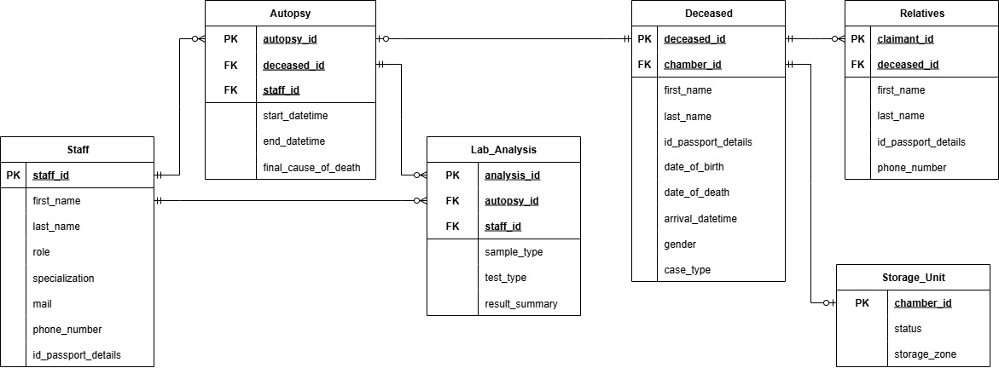
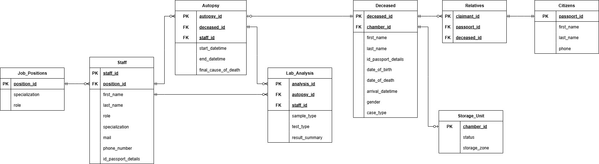

# Лабораторна робота №5
## Нормалізація бази даних
---
### Роботу виконали
Студенти групи ІО-46
Меджитова С.М., Орлик Д.В.
### Роботу перевірив
Русінов В.В.
---
## Мета роботи
* Пошук надлишковості та аномалій: виявлення потенційної надлишковості даних (наприклад, повторювані значення) або аномалій оновлення (проблеми вставки/оновлення/видалення) у поточній схемі.
* Перелік функціональних залежностей: визначте та перелічіть функціональні залежності (ФЗ) для кожної проблемної таблиці.
* Перевірка нормальних форм: оцініть поточну нормальну форму кожної таблиці (1NF, 2NF, 3NF) на основі її функціональних залежностей (ФЗ) та структури ключа.
* Застосування нормалізації: перетворення таблиць у вищі нормальні форми (до 3НФ) для усунення часткових та транзитивних залежностей.
---
## Хід роботи
### Пошук надлишковості та аномалій

Рисунок 1 – Початкова ER-діаграма бази даних моргу
Під час аналізу поточної схеми було виявлено надлишковість даних та потенційні аномалії у таблицях staff та relatives:
* У таблиці staff:
Поле role (Лаборант, Судмедексперт) жорстко прив'язане до specialization. Наприклад, спеціалізація "Професор" завжди належить до ролі "Судмедексперт". Якщо ми захочемо змінити назву ролі, доведеться редагувати кожен рядок працівника з цією спеціалізацією (аномалія оновлення).
* У таблиці relatives:
* Дані родича (ПІБ, паспорт, телефон) прив'язані безпосередньо до запису про померлого. Якщо одна і та сама людина є родичем для кількох померлих, її персональні дані будуть дублюватися. Це створює надлишковість.
### Перелік функціональних залежностей
Для кожної проблемної таблиці визначено такі залежності:
Таблиця staff:
* staff_id -> id_passport_details, first_name, last_name, specialization, phone_number, mail;
* specialization -> role (Транзитивна залежність: неключовий атрибут визначає інший неключовий атрибут).
Таблиця relatives:
claimant_id -> deceased_id, id_passport_details
id_passport_details -> first_name, last_name, contact_phone (Прихована сутність "Особа").
### Перевірка нормальних форм
Початкова схема бази даних знаходиться у 2NF (Другій нормальній формі).
* 1NF (Виконується): Усі значення в клітинках атомарні (типи ENUM та VARCHAR використовуються коректно, масивів немає).
* 2NF (Виконується): Усі таблиці мають прості первинні ключі (SERIAL PRIMARY KEY). Оскільки ключ складається лише з одного стовпця, часткова залежність від ключа неможлива.
* 3NF (Порушується): Наявні транзитивні залежності. У таблиці staff роль залежить від спеціалізації. У таблиці relatives дані особи залежать від номера паспорта, а не безпосередньо від claimant_id.
### Застосування нормалізації
Щоб привести базу даних до 3NF, проведемо декомпозицію:
Нормалізація таблиці staff:
Виносимо логіку посад в окрему таблицю-довідник, щоб уникнути повторення ролей для однакових спеціалізацій.
* Створюємо job_positions: (PK) position_id, specialization, role.
* Оновлюємо staff: видаляємо role та specialization, додаємо (FK) position_id.
Нормалізація таблиці relatives:
Виділяємо персональні дані людей в окрему таблицю, щоб уникнути дублювання інформації про одну й ту саму особу.
* Створюємо citizens: (PK) passport_id, first_name, last_name, phone.
* Оновлюємо relatives: залишаємо лише зв'язок deceased_id та (FK) passport_id.
### Перероблені SQL-інструкції CREATE TABLE
Нижче наведено команди для трансформації поточної бази даних моргу в 3NF.
```sql
-- Staff
-- Створення таблиці посад
CREATE TABLE IF NOT EXISTS job_positions (
    position_id SERIAL PRIMARY KEY,
    specialization VARCHAR(40) NOT NULL UNIQUE,
    role staff_role NOT NULL
);

-- Додавання колонки для зв'язку
ALTER TABLE staff ADD COLUMN position_id INT;

-- Перенесення унікальних комбінацій (спеціалізація + роль)
INSERT INTO job_positions (specialization, role)
SELECT DISTINCT specialization, role FROM staff;

-- Оновлення посилання у таблиці staff
UPDATE staff s
SET position_id = jp.position_id
FROM job_positions jp
WHERE s.specialization = jp.specialization AND s.role = jp.role;

-- Видалення старих колонок та додавання обмежень
ALTER TABLE staff 
    DROP COLUMN role,
    DROP COLUMN specialization,
    ALTER COLUMN position_id SET NOT NULL,
    ADD CONSTRAINT fk_staff_position FOREIGN KEY (position_id) REFERENCES job_positions(position_id);

-- Relatives
-- Створення таблиці персональних даних громадян
CREATE TABLE IF NOT EXISTS citizens (
    passport_id VARCHAR(9) PRIMARY KEY,
    first_name VARCHAR(25) NOT NULL,
    last_name VARCHAR(30) NOT NULL,
    phone VARCHAR(12) UNIQUE NOT NULL
);

-- Перенесення даних родичів (унікальні записи по паспорту)
INSERT INTO citizens (passport_id, first_name, last_name, phone)
SELECT DISTINCT id_passport_details, first_name, last_name, contact_phone 
FROM relatives;

-- Змінення структури таблиці relatives
ALTER TABLE relatives RENAME COLUMN id_passport_details TO passport_id;

ALTER TABLE relatives 
    DROP COLUMN first_name,
    DROP COLUMN last_name,
    DROP COLUMN contact_phone,
    ADD CONSTRAINT fk_relative_citizen FOREIGN KEY (passport_id) REFERENCES citizens(passport_id);
```
### ERD після нормалізації

Рисунок 2 – Оновлена нормалізована схема даних моргу
---
## Висновки
У ході лабораторної роботи було проведено повний аналіз схеми бази даних моргу. Шляхом виявлення транзитивних функціональних залежностей було встановлено, що початкова схема відповідала лише 2NF. Завдяки декомпозиції таблиць staff та relatives на більш дрібні сутності, було досягнуто Третьої нормальної форми (3NF). Це дозволило:
* Усунути дублювання персональних даних родичів.
* Спростити управління ролями персоналу через окремий довідник.
* Мінімізувати ризик виникнення аномалій вставки, видалення та оновлення даних.
