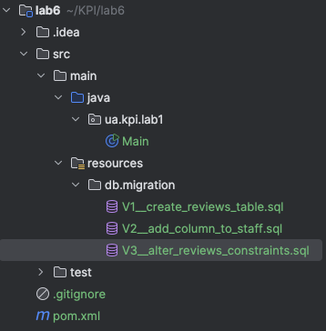
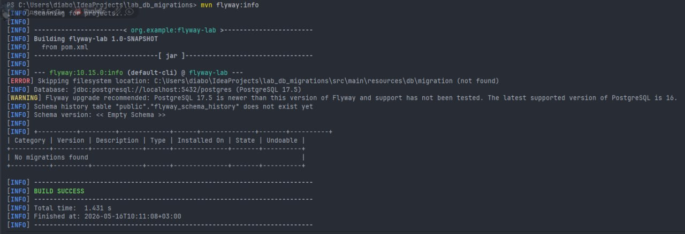
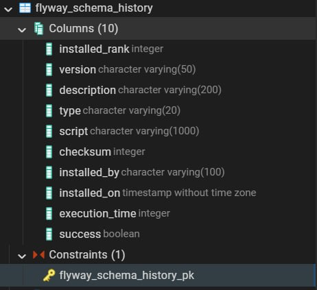
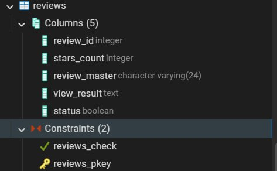
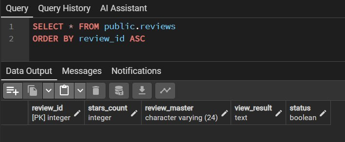
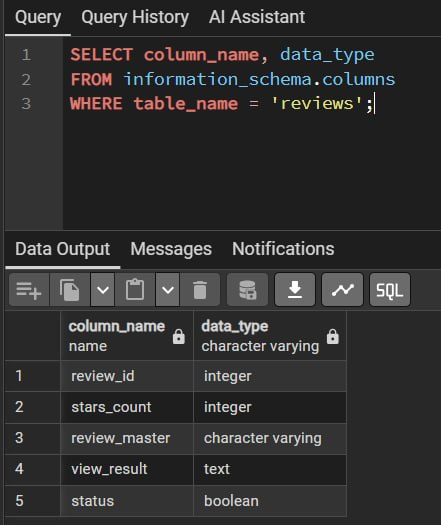

# Лабораторна робота №6

## Міграції схем за допомогою Flyway

---

### Роботу виконали

Студенти групи ІО-46
Меджитова С.М., Орлик Д.В.

### Роботу перевірив

Русінов В.В.

---

# Цілі

- Використати Flyway для керування схемами та дослідити, як Flyway може аналізувати та змінювати схему вашої бази даних.
- Зрозуміти конвенцію іменування Flyway-скриптів, застосування міграцій, генерування та застосування змін схеми.
- Написати кілька версійних SQL-міграцій для вашої схеми та застосувати їх через Flyway.
- Перевірити результати змін за допомогою SQL-запитів і задокументувати їх.
- Навчитися коректно використовувати контролювання версій міграцій у Git (скрипти зберігаються у проекті, а не змінюються після застосування).

---

# Структура проєкту



---

# Налаштування pom.xml
Для роботи Flyway у Maven-проєкті було додано необхідні залежності та плагін у файл `pom.xml`.
Flyway Maven Plugin використовується для запуску міграцій через команди Maven, а PostgreSQL Driver потрібен для підключення до бази даних PostgreSQL.

## Фрагмент pom.xml

```xml
<project xmlns="http://maven.apache.org/POM/4.0.0"
         xmlns:xsi="http://www.w3.org/2001/XMLSchema-instance"
         xsi:schemaLocation="http://maven.apache.org/POM/4.0.0
         http://maven.apache.org/xsd/maven-4.0.0.xsd">

    <modelVersion>4.0.0</modelVersion>

    <groupId>org.example</groupId>
    <artifactId>flyway-lab</artifactId>
    <version>1.0-SNAPSHOT</version>

    <properties>
        <maven.compiler.source>17</maven.compiler.source>
        <maven.compiler.target>17</maven.compiler.target>
    </properties>

    <dependencies>
        <dependency>
            <groupId>org.postgresql</groupId>
            <artifactId>postgresql</artifactId>
            <version>42.7.3</version>
        </dependency>


        <dependency>
            <groupId>org.flywaydb</groupId>
            <artifactId>flyway-core</artifactId>
            <version>10.15.0</version>
        </dependency>

        <dependency>
            <groupId>org.flywaydb</groupId>
            <artifactId>flyway-database-postgresql</artifactId>
            <version>10.15.0</version>
        </dependency>

    </dependencies>

    <build>
        <plugins>

            <plugin>
                <groupId>org.flywaydb</groupId>
                <artifactId>flyway-maven-plugin</artifactId>
                <version>10.15.0</version>

                <configuration>
                    <url>jdbc:postgresql://localhost:5432/lab2</url>
                    <user>postgres</user>
                    <password>mudessir</password>

                    <schemas>
                        <schema>public</schema>
                    </schemas>
                </configuration>

            </plugin>

        </plugins>
    </build>

</project>
```

## Папка для міграцій

У проєкті було створено папку:

```text
src/main/resources/db/migration
```
Саме в цій папці Flyway автоматично шукає SQL-файли міграцій.

---

## Міграція V1

Файл V1__create_reviews_table.sql містить першу зміну схеми бази даних. У першій міграції було створено таблицю `reviews` для збереження відгуків. Також були додані основні поля таблиці та первинний ключ `review_id`.

```sql
CREATE TABLE reviews (
                         review_id SERIAL PRIMARY KEY,
                         staff_id INT NOT NULL,
                         review_text TEXT NOT NULL,
                         created_at TIMESTAMP DEFAULT CURRENT_TIMESTAMP
);
```

## Міграція V2

Файл V2__add_column_to_staff.sql містить другу зміну схеми. У другій міграції до таблиці `reviews` було додано нові стовпці: рейтинг, статус відгуку та ознаку анонімності. Для кожного нового поля були встановлені значення за замовчуванням.

```sql

ALTER TABLE reviews
    ADD COLUMN rating NUMERIC(2,1) DEFAULT 0.0;

ALTER TABLE reviews
    ADD COLUMN status VARCHAR(20) DEFAULT 'new';

ALTER TABLE reviews
    ADD COLUMN is_anonymous BOOLEAN DEFAULT false;
```

## Міграція V3

Файл V3__alter_reviews_constraints.sql містить наступну зміну схеми бази даних. У третій міграції були додані обмеження (`CHECK`) для перевірки правильності значень рейтингу та статусу. Також поле `review_text` було зроблено обов’язковим для заповнення.

```sql
ALTER TABLE reviews
    ALTER COLUMN review_text SET NOT NULL;

ALTER TABLE reviews
    ADD CONSTRAINT chk_reviews_rating
        CHECK (rating >= 0 AND rating <= 5);

ALTER TABLE reviews
    ADD CONSTRAINT chk_reviews_status
        CHECK (status IN ('new', 'approved', 'rejected'));
```

---

# Запуск міграцій

Після створення SQL-файлів було виконано команду:  

```
mvn flyway:migrate
```

Ця команда запускає Flyway, перевіряє папку з міграціями та застосовує всі нові скрипти у правильному порядку.

---

## Перевірка результату у консолі



Після виконання команди у консолі було отримано повідомлення про успішне застосування міграцій. Це означає, що Flyway підключився до бази даних і виконав SQL-скрипти без помилок.

---

## Перевірка таблиці flyway_schema_history

Після роботи Flyway у базі даних була створена службова таблиця flyway_schema_history. У ній Flyway зберігає інформацію про виконані міграції, їх версії, назви, час виконання та статус успішності.



Було також перевірено структуру таблиці reviews. На скріншоті видно створені стовпці таблиці та обмеження, які були додані до неї після виконання міграцій.



## Перевірка таблиці reviews через SELECT

Для перевірки таблиці було виконано запит:

```sql
SELECT * FROM public.reviews
ORDER BY review_id ASC;
```



Запит показує структуру таблиці reviews та її основні поля. Це підтверджує, що таблиця була створена та доступна для перегляду через SQL-запит.

## Перевірка типів даних у таблиці reviews

Для додаткової перевірки було виконано запит до information_schema.columns:
```sql
SELECT column_name, data_type
FROM information_schema.columns
WHERE table_name = 'reviews';
```


Цей запит дозволяє переглянути всі стовпці таблиці reviews та їх типи даних. Результат підтверджує, що структура таблиці була створена коректно.

---

# Висновок
У результаті лабораторної роботи було налаштовано Flyway для Maven-проєкту та створено кілька SQL-міграцій для зміни схеми PostgreSQL. Міграції були успішно застосовані, а результат перевірено через консоль, таблицю flyway_schema_history та SQL-запити.
Flyway дозволяє зручно контролювати зміни структури бази даних і зберігати історію всіх виконаних міграцій.
